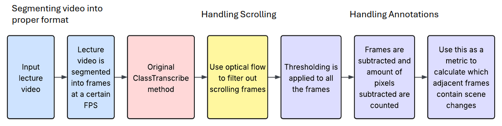

# Accessibility-AI-and-Video

This project explores methods for enhancing educational accessibility by transforming lecture videos into structured, book-like formats. We use techniques in Computer Vision and Machine Learning — such as optical flow, scene segmentation, and CNN-based analysis to detect visual transitions and improve readability for all users, especially those with learning differences or limited access to multimedia content.


## File Structure
```plaintext
project/
├── annotations/
│   ├── masking.py                           # Applies Gaussian blur and thresholding to extract foreground
|   ├── masking_and_subtraction.py           # Full pipeline for masking + subtraction + scene detection
|   └── subtraction.py                       # Identifies scene changes by pixel-level subtraction
├── scrolling/
│   ├── scroll_detector.ipynb                # Optical flow-based scroll detection
│   └── webcam_OF_demo.ipynb                 # Real-time optical flow demo using webcam
├── segmenting/
│   ├── CNN.ipynb                            # Convolutional Neural Network for scene segmentation
│   └── Labeling.ipynb                       # Manual labeling tool for training data
├── archived
├── data                                     # Includes example data used
├── presentations                            # Includes posters and presentations
```

## Pipeline of the project



## Requirements
This project uses the following libraries and tools:
- Python 3.8+
- OpenCV
- NumPy
- Matplotlib
- TensorFlow / PyTorch (depending on CNN implementation)
- Jupyter Notebook

To install dependencies:
``` pip install -r requirements.txt ```
## Folder Descriptions

### 📁 annotations/ - Handling Annotations

Given an engineering video lecture, aims to distinguish frames with annotations and redundant frames from scene changes.

### Example Pipeline


The pipeline involves extracting frames, applying masks, performing pixel-level subtraction, and counting the remaining non-null pixels to detect scene transitions.

---

### masking.py

Thresholding is used to isolate the foreground elements in segmented frames. This works by:

1. Applying a **Gaussian Blur** to reduce noise,
2. Reducing the RGB color range,
3. Applying **thresholding** to produce a binary (black and white) image based on a constant value \( a_{x,y} < t \).

**Original Image:**  


**Thresholded Foreground:**  


**Masked Output:**  


---

### subtraction.py

This method compares pairs of consecutive frames and "subtracts" similar pixels:

- For each adjacent frame pair (`frame1`, `frame2`), if pixel \((x, y)\) is similar within a threshold, it's nulled out.
- This is repeated across all frames to identify major changes.
- Then, frames with more than **1.5% remaining (non-null) pixels** are flagged as **potential scene changes**.

---

### masking_and_subtraction.py

The `masking_and_subtraction.py` script combines all the above into a streamlined pipeline:
- Frame extraction
- Masking and subtraction
- Remaining pixel analysis
- Scene change prediction and output generation

---

#### Example Output
Extracting frames 19:47:37

Creating masks 19:47:42

Starting subtraction 19:48:19

Counting remaining 19:48:41

Selecting frames 19:48:41

[21, 25, 226, 227, 228, 282, 300, 301, 320, 321, 354, 355, 356, 369, 370, 371, 385, 386, 407, 408, 409, 410, 411, 412, 413, 547, 548, 549, 550, 551, 552]

Finished 19:48:41

 
---
### 📁 scrolling/ - Detecting Scrolling Events
Detects scrolling within lecture videos using CNN-based visual similarity and optical flow.

### scroll_detector.ipynb
This notebook performs a three-stage pipeline:
1. Frame Extraction: Extracts one frame per second from the lecture video.
2. CNN-Based Grouping: Uses VGG16 features to group visually similar frames, separating slide changes from continuous scrolling.
3. Optical Flow Analysis: Computes vertical motion between adjacent frames using Farneback dense optical flow. This identifies scrolling based on:
    - Rewarded Vertical Motion: Weighted by coverage of motion area.
    - Vertical Std Dev: Variability in vertical motion.
    - Grid-Based Std Dev: Motion consistency across different regions.

The output is a .csv file per scene group indicating how much scrolling occurred between each frame.

---

### webcam_OF_demo.ipynb
Live webcam-based demo that visualizes optical flow in real time. Helpful for testing tuning parameters.

---

### 📁 segmenting/ - Scene Segmentation and Labeling

### CNN.ipynb
This notebook extracts frames from a video and compares them using a pre-trained Convolutional Neural Network (CNN), specifically VGG16 from Keras. It uses CNN feature vectors to compute visual similarity between scenes and saves the computed distances to a text file.

It performs the following steps:
- Extracts one frame per second from the input video
- Converts each frame into a feature vector using the VGG16 model
- Computes the Euclidean distance between consecutive frame vectors
- Saves the distance values to output/txt/output.txt
- Helps identify slide changes or major scene transitions based on the distance values


Example:

**Input:**  
- Video file in `data/input/`

**Output:**  
- Feature distances saved in `data/output/output_cropped_video.txt`
- Extracted frames are saved in `data/output/segmented_frames_cropped_video`
---

### Labeling.ipynb
A small notebook to help label frames of a video as scene changes/not scene changes with a flexible interval between selected frames (sampling frequency).  Traverses given video backwards.  Displays two buttons ('scene change' and 'no scene change') and two frames from the video.  The top frame chronologically preceeds the bottom frame by one interval.  

If 'scene change' is clicked, a row with the frame number, sample number (0-indexed), and 'True' is written to the csv.  

If 'scene change' is clicked, a row with the frame number, sample number, and 'false' is written.  


---
## Author
Developed by [Sunwoo Baek](https://github.com/sbaek21), [Supia Park](https://github.com/supia930), [Ashley Li](https://github.com/ashleyyli), [Enya Chen](https://github.com/3nya)